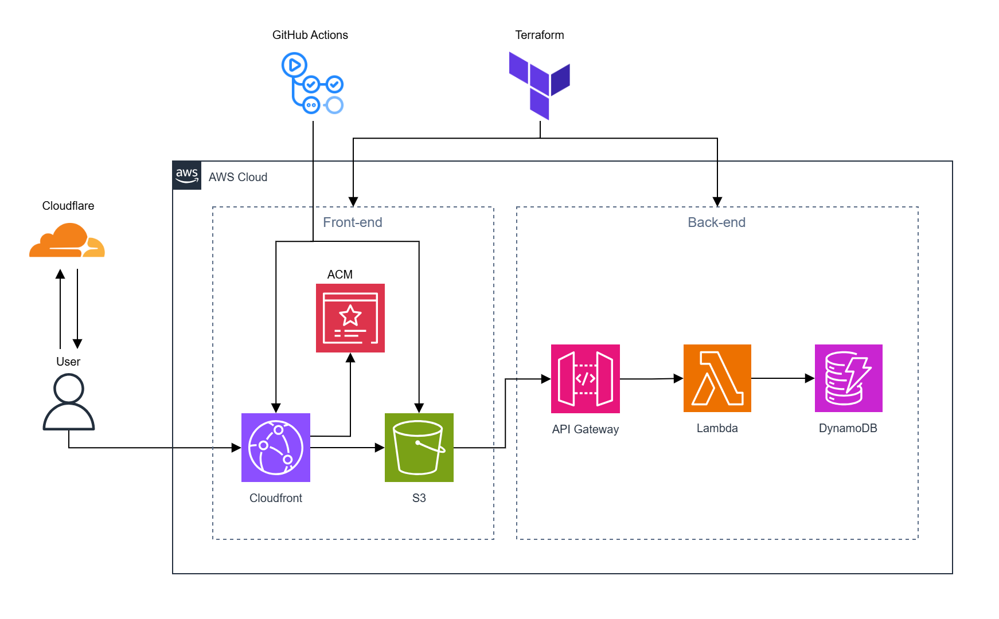

# Cloud Resume AWS
### Architecture Diagram

### Overview
I created this project to familiarize myself with AWS and learn more about cloud computing, as it is one of the topics that I have an interest in for my career. While I was feeling overwhelmed about various services in AWS and their pricing, I discovered [The Cloud Resume Challenge Guidebook](https://cloudresumechallenge.dev/) by Forrest Brazeal. In a nutshell, this book contains resources and general guides to host your resume on AWS as the challenge. All services used in this project are covered within the AWS free tier. In fact, I spent no bucks at all on AWS even after the project was done.

The book is divided into several chunks, each with its own difficulties. I had to meddle with setting up a static website, Python code, CORS issues, learning Terraform and GitHub Actions from scratch, among other things. Thus, I spent over a month to finish this project. That's why I'm very pleased that I was able to finish this project, even though there are clearly some areas for improvement.

You can visit my resume website [here](https://cv.zaril.my.id/). I also planned to write an article on Medium about my experience while doing this project. Just hope I can publish it soon.
### Directory Structure
- `.github/workflows/`: Contains the front-end deployment workflow.
- `infra/`: Contains some Terraform configuration files and Python visitor counter code.
- `static-site/`: Contains the website code, assets, and JavaScript code to invoke the Lambda function via API Gateway URL.
### Services Used
- **Cloudflare**: I planned to use Route 53 to manage my DNS records by creating a hosted zone. However, Route 53 is not completely free, so I switched to Cloudflare which is also widely used.
- **AWS Organizations**: Used to simplify the management of AWS accounts, since I created separate accounts for development and production, then combined with IAM Identity Center to enable SSO for easier login access.
- **CloudFront**: A CDN to cache my website content and distribute it to wider geographic area.
- **Certificate Manager**: Used to obtain an SSL/TLS certificate for my domain to ensure secure communication.
- **S3 bucket**: Stores my website code, accessed without enabling static web hosting. Instead, I integrated it with CloudFront using Origin Access Control (OAC).
- **Lambda**: Used to run Python code without provisioning any server.
- **API Gateway**: Used to create an HTTP API that accepts requests from the website and communicates with the Lambda function.
- **DynamoDB**: A NoSQL database that stores the visitor count to my website.
